#  1. 原始模型

Best Val Acc: 0.0916

~~~python
epochs = 10
batch_size = 32
lr = 1e-3

transforms.Compose(
    [
        transforms.Resize(256),
        transforms.CenterCrop(224),
        transforms.ToTensor(),
        transforms.Normalize(mean=[0.485, 0.456, 0.406], std=[0.229, 0.224, 0.225]),
    ]
)
~~~

# 2. 4 层 CNN

Best Val Acc: 0.0034

训练时模型迅速崩溃

~~~python
epochs = 10
batch_size = 32
lr = 1e-3
~~~

# 3. 降低学习率 & 增大 batch_size

Best Val Acc: 0.1383

降低学习率从而让模型初期不会崩溃

增大 batch_size 使训练过程更稳定

从训练曲线可以发现，模型已经具备一定的学习能力了。但从 epoch 40 开始 train_loss 依旧下降，val_loss 不再下降，说明泛化能力已停滞

~~~python
epochs = 100
batch_size = 256
lr = 1e-4

transforms.Compose(
    [
        transforms.Resize(256),
        transforms.CenterCrop(224),
        transforms.ToTensor(),
        transforms.Normalize(mean=[0.485, 0.456, 0.406], std=[0.229, 0.224, 0.225]),
    ]
)
~~~

# 4. 数据增强

Best Val Acc: 0.0187

保持学习率和 epochs 不变，训练从过拟合转变为了欠拟合。并且 val loss 比 train loss 还小，说明 “作业很难，考试简单”

~~~python
epochs = 100
batch_size = 256
lr = 1e-4

transforms.Compose(
    [
        transforms.RandomResizedCrop(224, scale=(0.08, 1.0), interpolation=3),
        transforms.RandomHorizontalFlip(),
        transforms.TrivialAugmentWide(),
        transforms.ToTensor(),
        transforms.Normalize(
            mean=[0.485, 0.456, 0.406], std=[0.229, 0.224, 0.225]
        ),
        transforms.RandomErasing(
            p=0.5,
            scale=(0.02, 0.2),
            ratio=(0.3, 3.0),
            value="random",
            inplace=True,
        ),
    ]
)
~~~

# 5. 仅调整 num_workers 和 batch_size

模型从第 6 个 epoch 开始就崩溃了

~~~python
epochs = 500
batch_size = 64
lr = 1e-4

transforms.Compose(
    [
        transforms.RandomResizedCrop(224, scale=(0.08, 1.0), interpolation=3),
        transforms.RandomHorizontalFlip(),
        transforms.TrivialAugmentWide(),
        transforms.ToTensor(),
        transforms.Normalize(
            mean=[0.485, 0.456, 0.406], std=[0.229, 0.224, 0.225]
        ),
        transforms.RandomErasing(
            p=0.5,
            scale=(0.02, 0.2),
            ratio=(0.3, 3.0),
            value="random",
            inplace=True,
        ),
    ]
)
~~~

~~~bash
Epoch 1/500
Train Loss: 5.3419 | Train Acc: 0.0045
Val   Loss: 5.2981 | Val   Acc: 0.0017

Epoch 2/500
Train Loss: 5.2989 | Train Acc: 0.0039
Val   Loss: 5.2983 | Val   Acc: 0.0051

Epoch 3/500
Train Loss: 5.2988 | Train Acc: 0.0050
Val   Loss: 5.2984 | Val   Acc: 0.0017

Epoch 4/500
Train Loss: 5.2989 | Train Acc: 0.0048
Val   Loss: 5.2985 | Val   Acc: 0.0017

Epoch 5/500
Train Loss: 5.2987 | Train Acc: 0.0049
Val   Loss: 5.2986 | Val   Acc: 0.0017

Epoch 6/500
Train Loss: 5.2986 | Train Acc: 0.0048
Val   Loss: 5.2987 | Val   Acc: 0.0008

Epoch 7/500
Train Loss: 5.2986 | Train Acc: 0.0053
Val   Loss: 5.2988 | Val   Acc: 0.0008

Epoch 8/500
Train Loss: 5.2985 | Train Acc: 0.0056
Val   Loss: 5.2989 | Val   Acc: 0.0008

Epoch 9/500
Train Loss: 5.2985 | Train Acc: 0.0056
Val   Loss: 5.2990 | Val   Acc: 0.0008

Epoch 10/500
Train Loss: 5.2985 | Train Acc: 0.0056
Val   Loss: 5.2991 | Val   Acc: 0.0008
~~~

# 6. 削弱数据增强

Best Val Acc: 0.0008

模型从一开始就崩溃了

~~~python
epochs = 500
batch_size = 64
lr = 1e-4

transforms.Compose(
    [
        transforms.RandomResizedCrop(224, scale=(0.5, 1.0), interpolation=3),
        transforms.RandomHorizontalFlip(),
        # transforms.TrivialAugmentWide(),
        transforms.ToTensor(),
        transforms.Normalize(
            mean=[0.485, 0.456, 0.406], std=[0.229, 0.224, 0.225]
        ),
        transforms.RandomErasing(
            p=0.3,
            scale=(0.02, 0.2),
            ratio=(0.3, 3.0),
            value="random",
            inplace=True,
        ),
    ]
)
~~~

# 7. 取消数据增强

Best Val Acc: 0.0840

表现比数据增强前更糟糕

~~~python
epochs = 100
batch_size = 64
lr = 1e-4

transforms.Compose(
    [
        transforms.Resize(256),
        transforms.CenterCrop(224),
        transforms.ToTensor(),
        transforms.Normalize(
            mean=[0.485, 0.456, 0.406], std=[0.229, 0.224, 0.225]
        ),
    ]
)
~~~

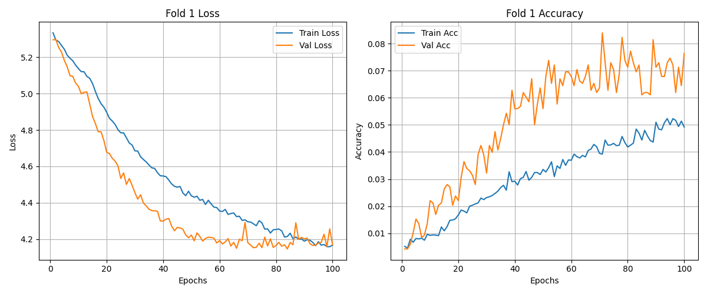

# 8. 设置 batch_size=256

Best Val Acc: 0.1578

使用和第三次训练相同的配置，训练曲线恢复正常（甚至 best val acc 高 2 个百分点），说明上一次训练模型崩溃确实是 batch_size 的问题，推测是数据集太难，batch_size 太小时 Batch Norm 非常不稳定

~~~python
epochs = 100
batch_size = 256
lr = 1e-4

transforms.Compose(
    [
        transforms.Resize(256),
        transforms.CenterCrop(224),
        transforms.ToTensor(),
        transforms.Normalize(mean=[0.485, 0.456, 0.406], std=[0.229, 0.224, 0.225]),
    ]
)
~~~

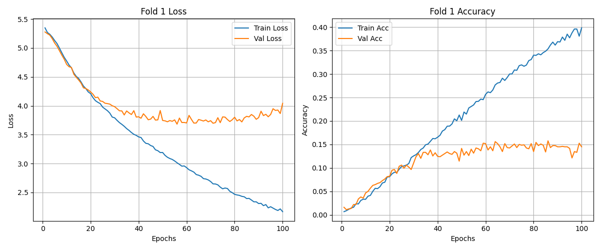

# 9. 应用弱数据增强

Best Val Acc: 0.1730

过拟合得到缓解

~~~python
epochs = 100
batch_size = 256
lr = 1e-4

transforms.Compose(
    [
        transforms.RandomResizedCrop(224, scale=(0.5, 1.0), interpolation=3),
        transforms.RandomHorizontalFlip(),
        transforms.ToTensor(),
        transforms.Normalize(mean=[0.485, 0.456, 0.406], std=[0.229, 0.224, 0.225]),
    ]
)
~~~

# 10. 增加全局平均池化

Best Val Acc: 0.1628

在全连接层前添加全局平均池化，有效缓解 train loss 和 val loss 倒挂的现象，但收敛速度仍然较慢

~~~python
epochs = 100
batch_size = 256
lr = 1e-4
~~~

~~~python
def __init__(self, num_classes=200):
# ...
self.avgpool = nn.AdaptiveAvgPool2d((1, 1))
# ...

def forward(self, x):
# ...
x = self.layer4(x)
x = self.avgpool(x)
x = self.fc(x)
return x
~~~

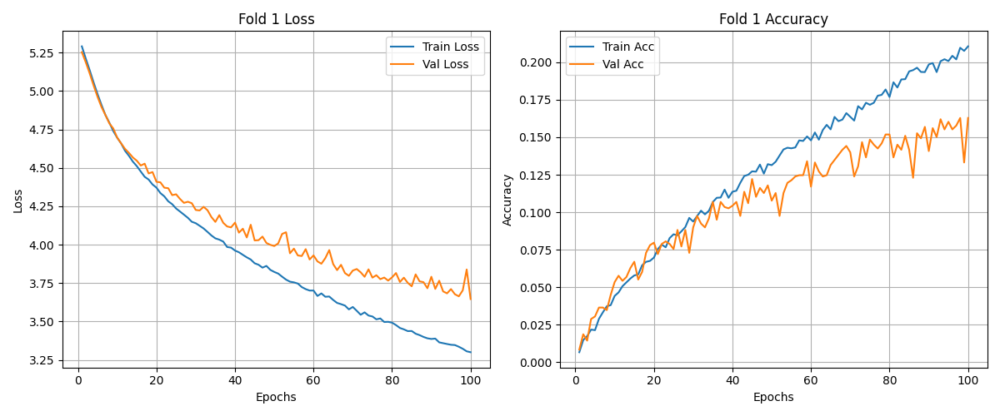

# 11. 改用余弦退火学习率 & 增大初始学习率

Best Val Acc: 0.3596

收敛速度大幅提升

~~~python
epochs = 100
batch_size = 256
lr = 1e-3
~~~

~~~python
scheduler = torch.optim.lr_scheduler.CosineAnnealingLR(optimizer, T_max=epochs)
~~~

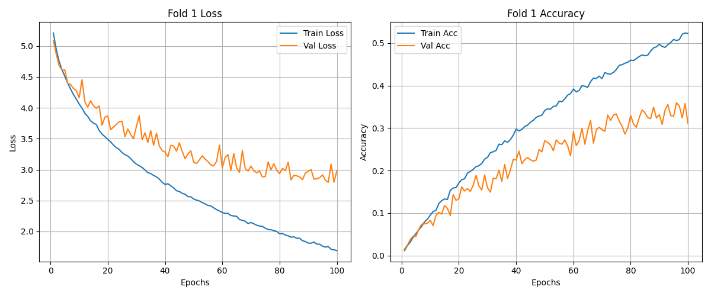

# 12. 十折交叉验证

Average Acc: 0.3585
Best    Acc: 0.3859

保持配置不变，执行十折交叉验证

~~~python
epochs = 100
batch_size = 256
lr = 1e-3
~~~

~~~python
num_folds = 10
~~~

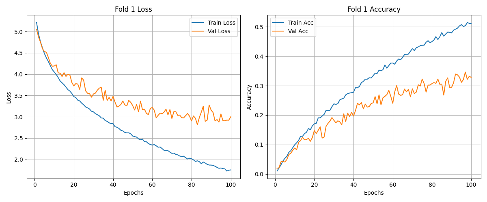
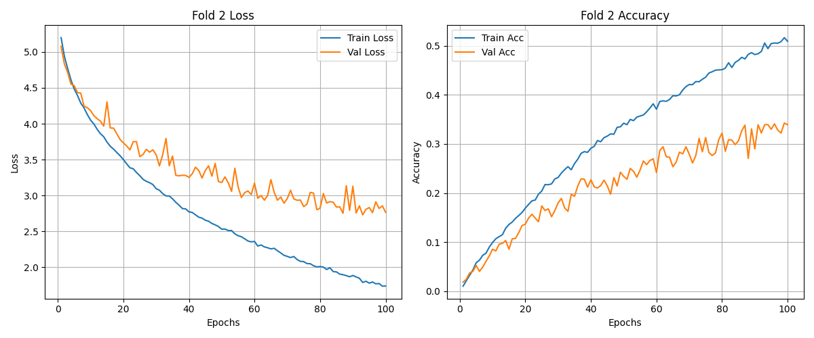
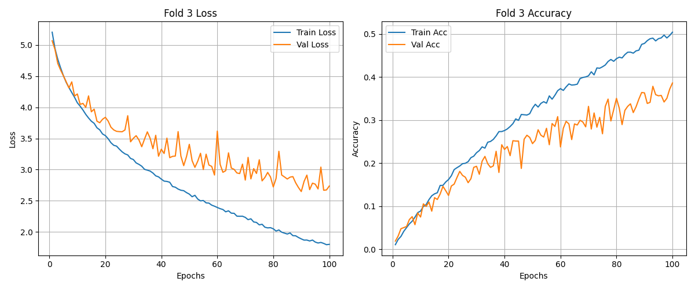
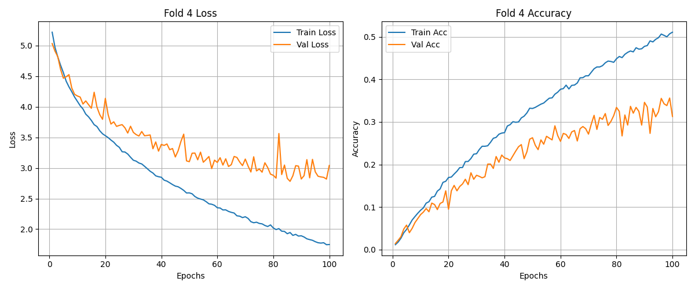
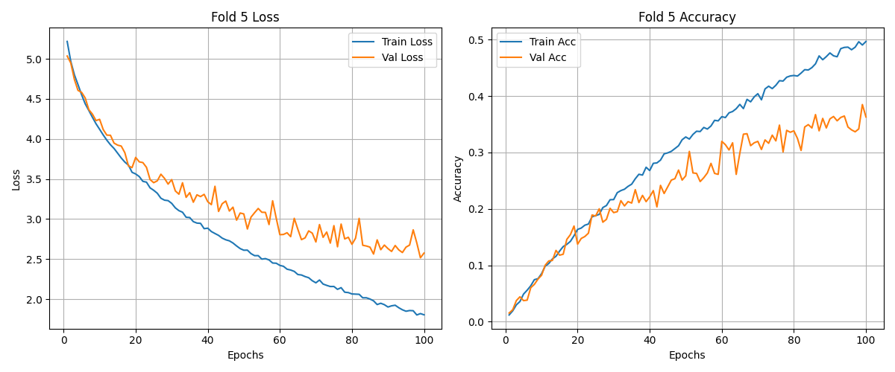
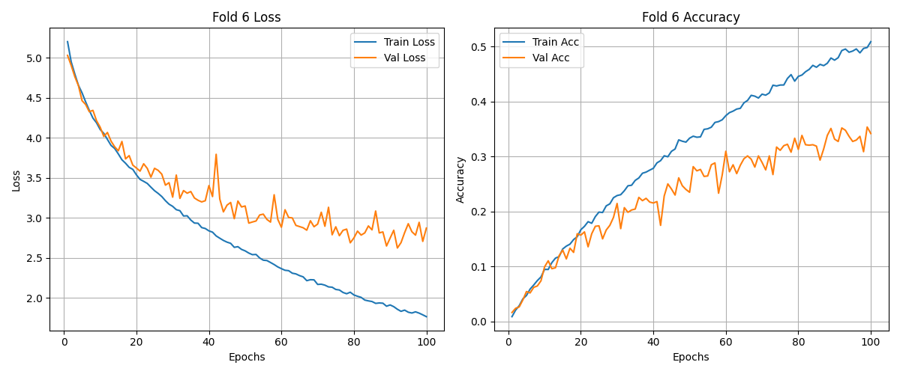

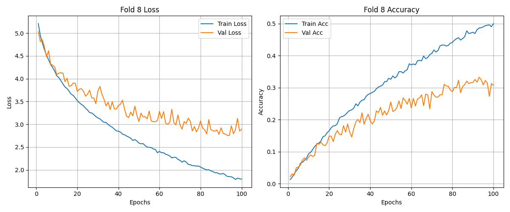
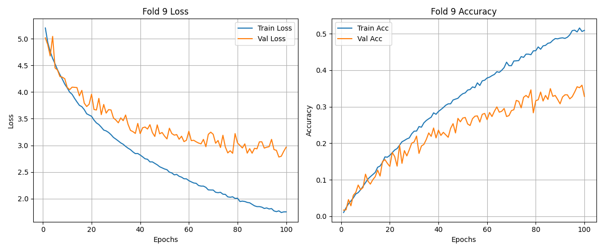
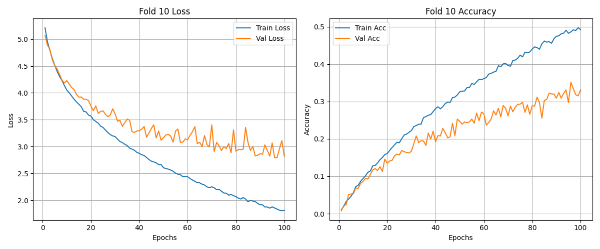
