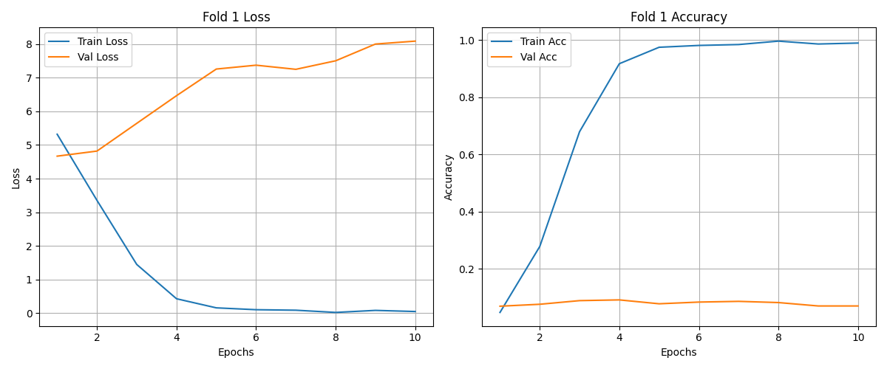
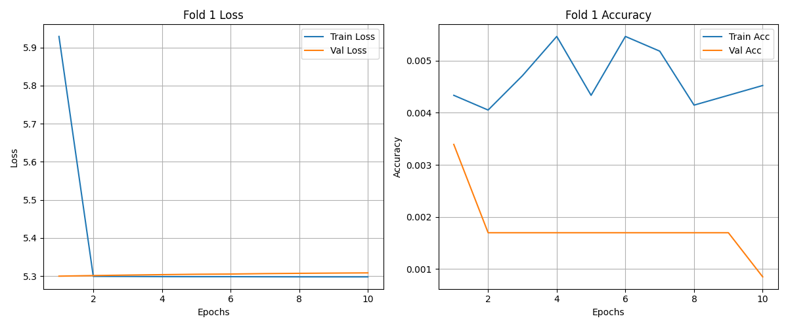
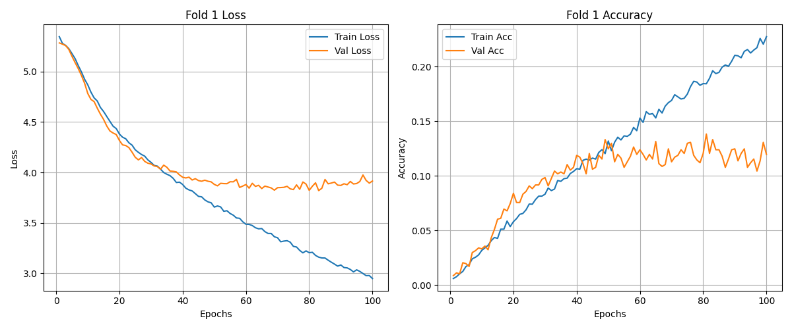
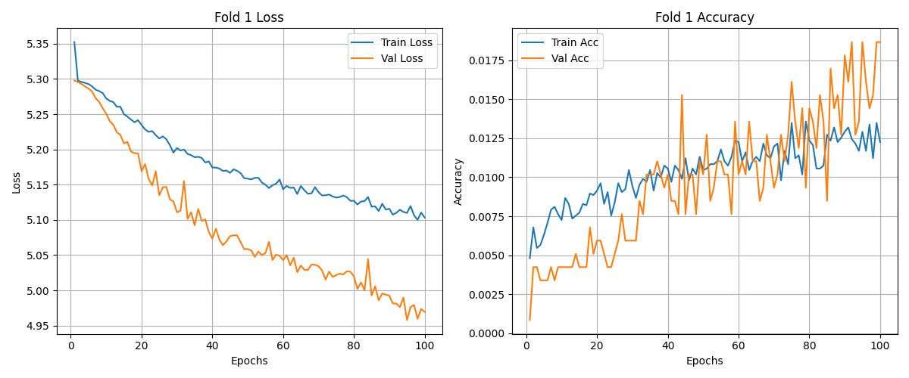

# 原始模型

Best Val Acc: 0.0916

~~~python
epochs = 10
batch_size = 32
lr = 1e-3

transforms.Compose(
    [
        transforms.Resize(256),
        transforms.CenterCrop(224),
        transforms.ToTensor(),
        transforms.Normalize(mean=[0.485, 0.456, 0.406], std=[0.229, 0.224, 0.225]),
    ]
)
~~~

# 4 层 CNN

Best Val Acc: 0.0034

~~~python
epochs = 10
batch_size = 32
lr = 1e-3

transforms.Compose(
    [
        transforms.Resize(256),
        transforms.CenterCrop(224),
        transforms.ToTensor(),
        transforms.Normalize(mean=[0.485, 0.456, 0.406], std=[0.229, 0.224, 0.225]),
    ]
)
~~~

# 降低 lr & 增大 batch_size

Best Val Acc: 0.1383

~~~python
epochs = 100
batch_size = 256
lr = 1e-4

transforms.Compose(
    [
        transforms.Resize(256),
        transforms.CenterCrop(224),
        transforms.ToTensor(),
        transforms.Normalize(mean=[0.485, 0.456, 0.406], std=[0.229, 0.224, 0.225]),
    ]
)
~~~

# 数据增强

Best Val Acc: 0.0187

~~~python
epochs = 100
batch_size = 256
lr = 1e-4

transforms.Compose(
    [
        transforms.RandomResizedCrop(224, scale=(0.08, 1.0), interpolation=3),
        transforms.RandomHorizontalFlip(),
        transforms.TrivialAugmentWide(),
        transforms.ToTensor(),
        transforms.Normalize(
            mean=[0.485, 0.456, 0.406], std=[0.229, 0.224, 0.225]
        ),
        transforms.RandomErasing(
            p=0.5,
            scale=(0.02, 0.2),
            ratio=(0.3, 3.0),
            value="random",
            inplace=True,
        ),
    ]
)
~~~

# 仅调整 num_workers 和 batch_size

模型从第 6 个 epoch 开始就崩溃了

~~~python
epochs = 500
batch_size = 64
lr = 1e-4

transforms.Compose(
    [
        transforms.RandomResizedCrop(224, scale=(0.08, 1.0), interpolation=3),
        transforms.RandomHorizontalFlip(),
        transforms.TrivialAugmentWide(),
        transforms.ToTensor(),
        transforms.Normalize(
            mean=[0.485, 0.456, 0.406], std=[0.229, 0.224, 0.225]
        ),
        transforms.RandomErasing(
            p=0.5,
            scale=(0.02, 0.2),
            ratio=(0.3, 3.0),
            value="random",
            inplace=True,
        ),
    ]
)
~~~

~~~bash
Epoch 1/500
Train Loss: 5.3419 | Train Acc: 0.0045
Val   Loss: 5.2981 | Val   Acc: 0.0017

Epoch 2/500
Train Loss: 5.2989 | Train Acc: 0.0039
Val   Loss: 5.2983 | Val   Acc: 0.0051

Epoch 3/500
Train Loss: 5.2988 | Train Acc: 0.0050
Val   Loss: 5.2984 | Val   Acc: 0.0017

Epoch 4/500
Train Loss: 5.2989 | Train Acc: 0.0048
Val   Loss: 5.2985 | Val   Acc: 0.0017

Epoch 5/500
Train Loss: 5.2987 | Train Acc: 0.0049
Val   Loss: 5.2986 | Val   Acc: 0.0017

Epoch 6/500
Train Loss: 5.2986 | Train Acc: 0.0048
Val   Loss: 5.2987 | Val   Acc: 0.0008

Epoch 7/500
Train Loss: 5.2986 | Train Acc: 0.0053
Val   Loss: 5.2988 | Val   Acc: 0.0008

Epoch 8/500
Train Loss: 5.2985 | Train Acc: 0.0056
Val   Loss: 5.2989 | Val   Acc: 0.0008

Epoch 9/500
Train Loss: 5.2985 | Train Acc: 0.0056
Val   Loss: 5.2990 | Val   Acc: 0.0008

Epoch 10/500
Train Loss: 5.2985 | Train Acc: 0.0056
Val   Loss: 5.2991 | Val   Acc: 0.0008
~~~
